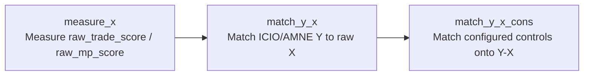

# 当前项目入口与目录导航

**老师复核请先阅读 [修正说明与复核指南](review/README.md)**：说明此前编码前数据的误用、当前修正链路、公开材料与单独交付数据的边界，以及无需调用模型或运行回归的核验方法。

从本项目根目录运行。测算入口为 `run_pipeline.py measure-x`（实际执行可能调用 LLM）；只复用现有 X 时直接使用匹配入口。

## 匹配样本规则与现有数据状态

`configs/matching_specs.json` 默认使用 `"row_policy": {"drop_row": true, "keep_domestic": false}`：
Y 准备步骤先删除任一端为 `ROW` 的观测及本国国家对，再匹配 X、匹配控制变量。
需要在 DTA 匹配产品中保留本国对时，将现有 `keep_domestic` 明确改成 `true`；
`drop_row` 仍独立控制 ROW。省略开关时也按新默认值处理。
比较忽略大小写与首尾空白，原始 ISO 字段不变，两端为空或缺失不会被判成本国对。

**现有 `outputs/matched_data` 仍是旧配置（保留本国对）生成的数据，本次未重建。**
在新默认配置下，对这些旧 Y–X 文件运行控制变量匹配（包括 `--dry-run`）会明确提示
需要重新构建；`--force` 也不能跳过配置核对。新输出应放入独立版本目录，并按
[本次变更与后续重建步骤](docs/sample_policy_change_20260915.md) 更新 Stata 输入快照。
Stata 读取自身 `data/raw/io/` 快照，并在生成 OLS/PPML 数据前检查、兜底删除
ROW 与本国对；DTA 中显式保留本国对不会改变 Stata 的国际样本规则。
旧快照、派生数据、日志、manifest 与正式结果保持原状。

## 日常使用：三个阶段

1. **测算 X**：LLM 分类与赋权，再计算国家对得分；`all` 将测算和协议 dummy／政治距离整理接起来。
2. **匹配 Y–X**：运行 `match-y-x`。
3. **匹配控制变量**：分别运行 `match-y-x-cons` 的贸易和 MP 规格。

先检查，不计算也不写文件：

```powershell
python -B run_pipeline.py all --dry-run
python -B run_pipeline.py match-y-x --years 2000 2019 --dry-run
python -B run_pipeline.py match-y-x-cons --years 2000 2019 --control-spec trade_candidate_pool_v1 --dry-run
python -B run_pipeline.py match-y-x-cons --years 2000 2019 --control-spec mp_controls_v1 --dry-run
```

实际执行时去掉 `--dry-run`。如果该步骤已有输出，程序会在执行前停止；明确要更新时才加 `--force`。这些规则也适用于直接运行测算步骤脚本。

|选项|含义|
|---|---|
|`--dry-run`|只检查并列出路径、缺少的输入和已有输出；不调用模型，不计算或写文件。|
|`--force`|允许覆盖本次步骤的已有输出；它不会关闭模型缓存复用。|
|`--resume`（默认）|尽量复用仍有效的模型结果；未完成或失效的条目仍可能调用模型。|
|`--no-resume --force`|明确重新编码并允许替换已有模型结果；仅在确实需要重新调用模型时使用。|

`all` 沿用原有范围：测算和辅助数据构建，后续两阶段匹配仍分别运行。只使用现有 X 时，从第 2 阶段开始；无需再运行 LLM。

计算指标前会核对输入、分类与权重的对应关系。旁边的 `*.provenance.json` 保存输入版本记录；`frozen_*_baseline` 是已核验旧文件的兼容基线，不能当作一次新计算记录。历史 CSV 和 manifest 保留原文。路径检查通过不等于已完成从头数值复现。

本次入口保护修复及恢复方法见 [修复记录](docs/pipeline_safety_fix_20260915.md)。

|工作|入口|有效数据/输出|
|---|---|---|
|测算 X|`run_pipeline.py measure-x`、`src/measure_x_01_…` 至 `measure_x_17_…`|`data/raw` → `data/interim` → `data/processed`；权重为 `final_provision_weights.csv`|
|Y–X 匹配|`run_pipeline.py match-y-x`|`configs/matching_specs.json`；默认 `outputs/matched_data`|
|控制变量匹配|`run_pipeline.py match-y-x-cons --control-spec trade_candidate_pool_v1` 或 `mp_controls_v1`|配置驱动；控制变量仍有候选项|
|当前 fractional 匹配产品|`outputs/matched_data/`|与默认输出目录一致；下游 Stata 保留自己的输入快照|
|只读历史审计|`src/audit_trade_mp_matching_2019.py`|备份由 `src/archive_paths.py` 解析；本次未运行该审计的重算部分|

```text
src/ + run_pipeline.py       测算、匹配及辅助代码
configs/ + prompts/         匹配配置与编码提示词
data/{raw,interim,processed,need_dummy}/  原始、过程、得分与辅助输入
Explained_variable/         ICIO/AMNE 被解释变量与身份映射
control__variable/          关税、Gravity 源数据
ideapoint/                  政治距离上游数据
outputs/matched_data/       当前 Y–X、控制变量匹配数据及诊断
logs/ + manifests/          运行日志与构建证据
docs/ + tests/              方法、契约与测试
```

匹配结果统一使用 `outputs/matched_data/`；上游源数据目录保持原名。完整只读入口检查：

```powershell
python -B run_pipeline.py all --dry-run
python -B run_pipeline.py match-y-x --years 2000 2019 --dry-run
python -B run_pipeline.py match-y-x-cons --years 2000 2019 --control-spec trade_candidate_pool_v1 --dry-run
python -B run_pipeline.py match-y-x-cons --years 2000 2019 --control-spec mp_controls_v1 --dry-run
```

集中历史归档位于 [`../project_archive/dta_institutional_opening`](../project_archive/dta_institutional_opening/README.md)。
旧 `old data/` 和 `migration_backups/` 的历史文本引用保留，通过路径映射追溯。
迁移工具的新备份默认写入集中归档的独立版本目录；默认扫描仅包括工作区 `data/`、`outputs/`，归档历史不再参与写入。

当前输出目录与恢复：[输出路径说明](docs/output_paths.md)。
旧 `result/model_inputs`、`result/refactor_baseline`、`result/regression_2019` 已整组归档；历史文件保持原文，位置由 [映射配置](configs/historical_path_mappings.json) 解释。
本次通过仅证明整理未改变文件内容与入口路径；既有 manifest 新鲜度问题仍以 `manifests/measurement_compatibility_20260915.json` 为依据，不因整理自动消除。

---

# DTA Institutional Opening Pipeline

This project measures DTA institutional opening and constructs auditable model
inputs. The code is split into three independently runnable pipelines:



The matching refactor does not run regressions and does not call any external
model. The former `result/regression_2019` files are archived read-only legacy baselines;
new products are written under `outputs/matched_data`.

## Setup

Install dependencies and configure model credentials from `.env.example`:

```bash
pip install -r requirements.txt
```

The matching pipelines do not read `.env`. Model credentials are needed only
when explicitly running the measurement stages that call external models.

## Main commands

Inspect the three pipelines without writing files:

```bash
python run_pipeline.py measure-x --dry-run
python run_pipeline.py match-y-x --years 2019 --dry-run
python run_pipeline.py match-y-x-cons --years 2019 --control-spec trade_candidate_pool_v1 --dry-run
python run_pipeline.py match-y-x-cons --years 2019 --control-spec mp_controls_v1 --dry-run
```

Build the matching products:

```bash
python run_pipeline.py match-y-x --years 2019
python run_pipeline.py match-y-x-cons --years 2019 --control-spec trade_candidate_pool_v1
python run_pipeline.py match-y-x-cons --years 2019 --control-spec mp_controls_v1
```

Existing output files are never overwritten unless `--force` is supplied.
`--output-root` can redirect the complete matching output tree.

The original Stage 1/Stage 2 commands remain available:

```bash
python run_pipeline.py load
python run_pipeline.py stage1
python run_pipeline.py stage1a
python run_pipeline.py stage1a-arbitrate
python run_pipeline.py stage1a-finalize
python run_pipeline.py stage1b
python run_pipeline.py stage1b-arbitrate
python run_pipeline.py stage1b-finalize
python run_pipeline.py stage1-finalize
python run_pipeline.py stage2
python run_pipeline.py stage2-arbitrate
python run_pipeline.py finalize
python run_pipeline.py indices
python run_pipeline.py dummy
python run_pipeline.py diagnostics
```

`measure-x` without `--dry-run` runs the full measurement workflow and may call
the configured models. It is not needed to reuse existing raw scores.

The `dummy` step also writes the matching source expected by
`configs/matching_specs.json`:

```text
data/processed/trade_dummy_icio_2000_2023.csv
```

It is the exact 2000-2023 subset of `trade_dummy_icio_all_years.csv`.

## Matching configuration

All years, source templates, aliases, row policy, output roots, Gravity
columns, and control sets live in
[`configs/matching_specs.json`](configs/matching_specs.json).

Available control configurations:

- `legacy_2019_v1`: refactor comparison only.
- `trade_candidate_pool_v1`: confirmed trade base controls plus an unselected
  pool of trade-facilitation and cultural candidates.
- `mp_controls_v1`: `trade_agreement_dummy` and
  `idealpoint_abs_distance` only.

The following are matched candidates, not final regression selections:

```text
Trade-facilitation membership and agreements:
gatt_o / gatt_d / both_gatt
wto_o / wto_d / both_wto
eu_o / eu_d / both_eu
fta_wto / fta_wto_raw
rta_coverage / rta_type

Business start-up environment:
entry_cost_o / entry_cost_d
entry_proc_o / entry_proc_d
entry_time_o / entry_time_d
entry_tp_o / entry_tp_d

Cultural, social, legal, and historical proximity:
gmt_offset_2020_o / gmt_offset_2020_d
comlang_off / comlang_ethno
comrelig / cultural_distance_religion
legal_old_o / legal_old_d / legal_new_o / legal_new_d
comleg_pretrans / comleg_posttrans / transition_legalchange
comcol / col45
heg_o / heg_d
col_dep_ever / col_dep / col_dep_end_year / col_dep_end_conflict
empire / sibling_ever / sibling / sever_year / sib_conflict
scaled_sci_2021 / diplo_disagreement
```

`both_gatt`, `both_wto`, and `both_eu` are products of the corresponding
origin and destination membership indicators.
`cultural_distance_religion = 1 - comrelig`.
The `entry_*` fields describe business start-up conditions, not
customs-clearance or border-efficiency measures.

No `sample_trade_main` or `sample_mp_main` flag is generated by the candidate
pipeline.

## Main outputs

Control-free Y-X:

```text
outputs/matched_data/match_y_x/2019/
  trade_y_x_2019.csv
  trade_y_x_2019.dta
  mp_y_x_2019.csv
  mp_y_x_2019.dta
  matching_diagnostics.json
  build_manifest.json
```

Configured controls:

```text
outputs/matched_data/match_y_x_cons/trade_candidate_pool_v1/2019/
outputs/matched_data/match_y_x_cons/mp_controls_v1/2019/
```

Each configured-control directory includes the CSV/DTA dataset, merge
diagnostics, a variable dictionary, a build manifest, and a README.

The pre-refactor hashes and structural statistics are recorded in:

```text
../project_archive/dta_institutional_opening/matching_history/20260915_before_outputs_rename/refactor_baseline/baseline_manifest_2019.json
```

## Data rules

- The directed Y key is `year + iso_o + iso_d + sector_amne`.
- The X/control merge key is `year + iso_o_match + iso_d_match`.
- Original `iso_o`/`iso_d` are preserved.
- `ROM -> ROU` applies only to the matching fields.
- ROW and domestic observations are removed by default; set `row_policy.keep_domestic` to `true` to retain domestic flows in DTA matching. Existing outputs still reflect the old configuration; see the sample-policy change record.
- Domestic raw trade/MP scores and the agreement dummy remain zero.
- Missing tariffs, political distance, Gravity values, and candidates are not
  filled with zero.
- ICIO sector 20 remains missing for tariff.

Detailed contracts are in
[`docs/流水线命名与数据契约.md`](docs/流水线命名与数据契约.md)
and [`docs/匹配流程.md`](docs/匹配流程.md).

## Tests

```bash
python -m pytest -q
```

The suite uses local fixtures and optionally validates locally generated,
gitignored 2019 integration outputs. It never calls remote models.
