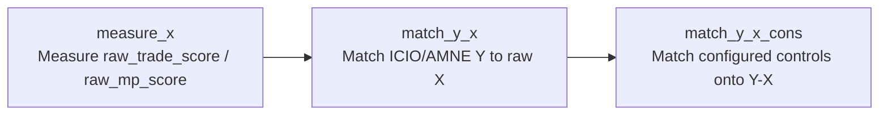

# DTA Institutional Opening Pipeline

This project measures DTA institutional opening and constructs auditable model
inputs. The code is split into three independently runnable pipelines:



The matching refactor does not run regressions and does not call any external
model. Existing `result/regression_2019` files are read-only legacy baselines;
new products are written under `result/model_inputs`.

## Setup

Install dependencies and configure model credentials from `.env.example`:

```bash
pip install -r requirements.txt
```

The matching pipelines do not read `.env`. Model credentials are needed only
when explicitly running the measurement stages that call external models.

## Main commands

Inspect the three pipelines without writing files:

```bash
python run_pipeline.py measure-x --dry-run
python run_pipeline.py match-y-x --years 2019 --dry-run
python run_pipeline.py match-y-x-cons --years 2019 --control-spec trade_candidate_pool_v1 --dry-run
python run_pipeline.py match-y-x-cons --years 2019 --control-spec mp_controls_v1 --dry-run
```

Build the matching products:

```bash
python run_pipeline.py match-y-x --years 2019
python run_pipeline.py match-y-x-cons --years 2019 --control-spec trade_candidate_pool_v1
python run_pipeline.py match-y-x-cons --years 2019 --control-spec mp_controls_v1
```

Existing output files are never overwritten unless `--force` is supplied.
`--output-root` can redirect the complete matching output tree.

The original Stage 1/Stage 2 commands remain available:

```bash
python run_pipeline.py load
python run_pipeline.py stage1
python run_pipeline.py stage1a
python run_pipeline.py stage1a-arbitrate
python run_pipeline.py stage1a-finalize
python run_pipeline.py stage1b
python run_pipeline.py stage1b-arbitrate
python run_pipeline.py stage1b-finalize
python run_pipeline.py stage1-finalize
python run_pipeline.py stage2
python run_pipeline.py stage2-arbitrate
python run_pipeline.py finalize
python run_pipeline.py indices
python run_pipeline.py dummy
python run_pipeline.py diagnostics
```

`measure-x` without `--dry-run` runs the full measurement workflow and may call
the configured models. It is not needed to reuse existing raw scores.

The `dummy` step also writes the matching source expected by
`configs/matching_specs.json`:

```text
data/processed/trade_dummy_icio_2000_2023.csv
```

It is the exact 2000-2023 subset of `trade_dummy_icio_all_years.csv`.

## Matching configuration

All years, source templates, aliases, row policy, output roots, Gravity
columns, and control sets live in
[`configs/matching_specs.json`](configs/matching_specs.json).

Available control configurations:

- `legacy_2019_v1`: refactor comparison only.
- `trade_candidate_pool_v1`: confirmed trade base controls plus an unselected
  pool of trade-facilitation and cultural candidates.
- `mp_controls_v1`: `trade_agreement_dummy` and
  `idealpoint_abs_distance` only.

The following are matched candidates, not final regression selections:

```text
Trade-facilitation membership and agreements:
gatt_o / gatt_d / both_gatt
wto_o / wto_d / both_wto
eu_o / eu_d / both_eu
fta_wto / fta_wto_raw
rta_coverage / rta_type

Business start-up environment:
entry_cost_o / entry_cost_d
entry_proc_o / entry_proc_d
entry_time_o / entry_time_d
entry_tp_o / entry_tp_d

Cultural, social, legal, and historical proximity:
gmt_offset_2020_o / gmt_offset_2020_d
comlang_off / comlang_ethno
comrelig / cultural_distance_religion
legal_old_o / legal_old_d / legal_new_o / legal_new_d
comleg_pretrans / comleg_posttrans / transition_legalchange
comcol / col45
heg_o / heg_d
col_dep_ever / col_dep / col_dep_end_year / col_dep_end_conflict
empire / sibling_ever / sibling / sever_year / sib_conflict
scaled_sci_2021 / diplo_disagreement
```

`both_gatt`, `both_wto`, and `both_eu` are products of the corresponding
origin and destination membership indicators.
`cultural_distance_religion = 1 - comrelig`.
The `entry_*` fields describe business start-up conditions, not
customs-clearance or border-efficiency measures.

No `sample_trade_main` or `sample_mp_main` flag is generated by the candidate
pipeline.

## Main outputs

Control-free Y-X:

```text
result/model_inputs/match_y_x/2019/
  trade_y_x_2019.csv
  trade_y_x_2019.dta
  mp_y_x_2019.csv
  mp_y_x_2019.dta
  matching_diagnostics.json
  build_manifest.json
```

Configured controls:

```text
result/model_inputs/match_y_x_cons/trade_candidate_pool_v1/2019/
result/model_inputs/match_y_x_cons/mp_controls_v1/2019/
```

Each configured-control directory includes the CSV/DTA dataset, merge
diagnostics, a variable dictionary, a build manifest, and a README.

The pre-refactor hashes and structural statistics are recorded in:

```text
result/refactor_baseline/baseline_manifest_2019.json
```

## Data rules

- The directed Y key is `year + iso_o + iso_d + sector_amne`.
- The X/control merge key is `year + iso_o_match + iso_d_match`.
- Original `iso_o`/`iso_d` are preserved.
- `ROM -> ROU` applies only to the matching fields.
- ROW observations are removed; domestic flows are retained.
- Domestic raw trade/MP scores and the agreement dummy remain zero.
- Missing tariffs, political distance, Gravity values, and candidates are not
  filled with zero.
- ICIO sector 20 remains missing for tariff.

Detailed contracts are in
[`docs/流水线命名与数据契约.md`](docs/流水线命名与数据契约.md)
and [`docs/匹配流程.md`](docs/匹配流程.md).

## Tests

```bash
python -m pytest -q
```

The suite uses local fixtures and optionally validates locally generated,
gitignored 2019 integration outputs. It never calls remote models.
