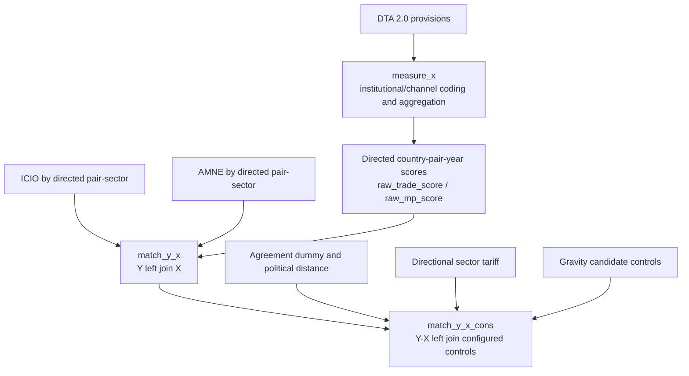

# Pipeline naming and data contract

## Three-stage architecture



Each executable step uses
`<pipeline>_<two-digit-step>_<verb_object>.py`. Shared modules are unnumbered:
`match_y_x_common.py` and `match_y_x_cons_common.py`.

## Measurement step names

| Step | New file | Previous file / responsibility |
|---:|---|---|
| 01 | `measure_x_01_load_dta.py` | `01_load_dta.py` |
| 02 | `measure_x_02_stage1a_code_institutional.py` | `03_stage1a_llm_code_institutional.py` |
| 03 | `measure_x_03_stage1a_compare_models.py` | `04_stage1a_compare_dual_model_results.py` |
| 04 | `measure_x_04_stage1a_arbitrate_conflicts.py` | `05_stage1a_llm_review_conflicts.py` |
| 05 | `measure_x_05_stage1a_finalize.py` | `06_stage1a_finalize.py` |
| 06 | `measure_x_06_stage1b_code_dimension.py` | `03_stage1b_llm_code_dimension.py` |
| 07 | `measure_x_07_stage1b_compare_models.py` | `04_stage1b_compare_dual_model_results.py` |
| 08 | `measure_x_08_stage1b_arbitrate_conflicts.py` | `05_stage1b_llm_review_conflicts.py` |
| 09 | `measure_x_09_stage1b_finalize.py` | `06_stage1b_finalize.py` |
| 10 | `measure_x_10_stage1_finalize.py` | `06_stage1_finalize.py` |
| 11 | `measure_x_11_stage2_code_trade_mp.py` | `07_stage2_llm_code_trade_mp.py` |
| 12 | `measure_x_12_stage2_compare_models.py` | `08_stage2_compare_dual_model_results.py` |
| 13 | `measure_x_13_stage2_arbitrate_conflicts.py` | `09_stage2_llm_review_conflicts.py` |
| 14 | `measure_x_14_finalize_provision_weights.py` | `10_finalize_weights.py` |
| 15 | `measure_x_15_compute_agreement_scores.py` | `11_compute_agreement_indices.py` |
| 16 | `measure_x_16_compute_country_pair_year_scores.py` | `12_compute_country_pair_indices.py` |
| 17 | `measure_x_17_validate_outputs.py` | `13_diagnostics.py` |

The following stay outside the numbered main measurement flow:

```text
10_finalize_weights_single_stage2_model.py
15_merge_chatgpt55_stage2_review.py
16_build_method_flowcharts.py
17_build_nature_method_flowcharts.py
migrate_trade_mp_schema.py
audit_trade_mp_matching_2019.py
```

They are auxiliary, migration, audit, or historical tools.

## Measurement output contract

The country-pair-year measurement product is keyed by:

```text
iso1 + iso2 + year
```

It contains at least:

```text
iso1
iso2
year
raw_trade_score
raw_mp_score
trade_agreement_dummy
num_active_agreements
agreement_id_list
method
pipeline_schema_version
impact_label_schema_version
```

The key is unique, raw scores are non-missing, domestic raw scores are zero,
and the existing multi-agreement aggregation method and version/source fields
are retained.

## Y-X and control keys

| Data | Key | Direction |
|---|---|---|
| ICIO / AMNE Y | `year + iso_o + iso_d + sector_amne` | original directed source-destination pair |
| Raw X scores | `year + iso_o_match + iso_d_match` | directed pair |
| Pair controls | `year + iso_o_match + iso_d_match` | directed pair |
| Tariff | `year + iso_o1 + iso_d1 + sector_amne` | directional numeric-code pair and sector |
| Gravity | `year + iso_o_match + iso_d_match` | directed pair |

Every merge is a left join from Y or Y-X and uses `many_to_one` validation.
The left-row count must be identical before and after each merge.

## ISO, ROW, domestic, and missing rules

`iso_o` and `iso_d` always preserve the source code. Only
`iso_o_match`/`iso_d_match` apply the configured `ROM -> ROU` bridge.

ROW observations are diagnosed and removed according to `row_policy.drop_row`.
Domestic flows remain when `row_policy.keep_domestic` is true. Domestic raw
trade score, raw MP score, and agreement dummy are structural zeros.

Values that may be filled with zero:

- structural domestic raw trade/MP scores;
- structural domestic agreement dummy;
- binary match/availability/sample diagnostic flags.

Values that must not be filled with zero:

- dependent `value`;
- tariff;
- `idealpoint_abs_distance`;
- any `entry_*` field;
- `comlang_off`, `comrelig`, or `cultural_distance_religion`.

ICIO sector 20 has no 2019 tariff source row and remains missing.

## Adding a year

For example, to add 2020:

1. Add `Explained_variable/icio2020.dta`.
2. Add `Explained_variable/amne2020.dta`.
3. Add `control__variable/tariff_2020.csv`.
4. Ensure the pair-year score file and Gravity source cover 2020.
5. Add `2020` to `years` in `configs/matching_specs.json`.
6. Optionally add 2020 acceptance values.
7. Run:

```bash
python run_pipeline.py match-y-x --years 2020 --dry-run
python run_pipeline.py match-y-x --years 2020
python run_pipeline.py match-y-x-cons --years 2020 --control-spec trade_candidate_pool_v1
python run_pipeline.py match-y-x-cons --years 2020 --control-spec mp_controls_v1
```

No matching function needs a new hard-coded year.

## Changing candidate controls

Edit only the candidate list in `configs/matching_specs.json`. For example,
remove `entry_tp_o`/`entry_tp_d` from
`trade_candidate_pool_v1.trade.candidate_controls`, or add a new field after
also adding it to `gravity.read_columns` and
`gravity.candidate_controls`. The merge and export code reads these roles from
configuration.

`trade_candidate_pool_v1` does not mean that any candidate was selected for a
final regression.
